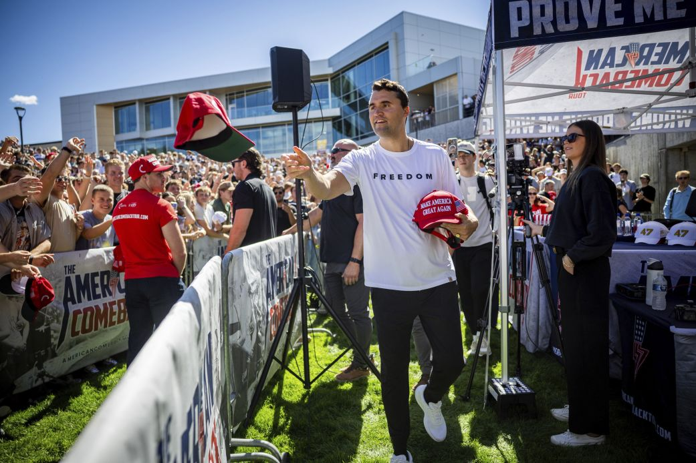
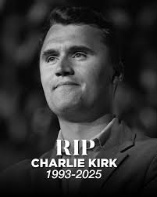

## 11 September 2025

Today I woke up to the said news that Charlie Kirk had beeb assassinated. This was very shocking, I actually didn't realise that he was so young, only 31.
For someone so young he had really achieved a lot and was very influential.

He confessed his love and belief in Christ. It really reminded me of one thing I once heard from RC Sproul, "we die in faith or we die in our sins" and it reminded me of this verse;

> Then I heard a voice from heaven say, “Write this: Blessed are the dead who die in the Lord from now on.” “Yes,” says the Spirit, “they will rest from their labor, for their deeds will follow them.” Revelation 14.13 (NIV)

I had a very strange conversation today with Lance. He first started by confessing that he was getting very frustrated and then he began to say he is really going to start being a trading influencer.

"It's time to join them (the scammers)... This is the way of the world whether we like it or not... It's time to take advantage of the weak"

I can't say I'm surprised by that. He spoke everyday about "I need to get the cards". But it's interesting to see the love of money transform a person and them begin the journey or at least consider the path that will be deadly.

The question is what am I going to do? Am I that fruitless that people can go down dark paths with me watching and helplessly so?

At one point he asked if I will join him. I told him I wouldn't. I did confess that since I'm applying for a second job, that is itself very morally questionable and would be my last stop.

But I need to pray for my friend Lance and hope God can do a work in him and free him from the love of money. At the same time, this little light of mine is not shining at all.

## 12 September 2025

The long-awaited Equal Experts interview came...and went. Now I just need to keep applying and keep working on my trading process. I was listening to Todd Freil talk about how God ordained (not just permitted) the death of Charlie Kirk and it really did plant some thoughts in my mind that I probably spent the entire night dreaming about...

## 13 September 2025

Given that God is sovereign and empowers His people, there is a mantra that kept ringing in my mind throughout the night "undefeatable". The christian should truly be the most mentally strong person in the world, really undefeatable.

> Of David. The LORD is my light and my salvation— whom shall I fear? The LORD is the stronghold of my life— of whom shall I be afraid? Psalm 27.1

## 15 September 2025

I finally got the feedback from Equal Experts and... I was not accepted. Definitely not the result I expected or wanted. This one stings because I spent so much time on this assessment, including my cursor subscription.
This was the feedback;

"Your solution was really looking good. Even a mobile view. During pairing you answered design questions and demonstrated to us you can use the Next.js framework. Tried in a TDD manner at the beginning but it was left half way off. The communication was focused on code rather then telling us the intent.

During the pairing noticed that you was not that familiar with TDD concepts and some of the code design hurt adding a discount feature because the cart storage was a List.

During the CICD the candidate only mentioned testing as a quality gate (lint, integration testing, perf testing, smoke testing, Vulnerability check, pair working, monitoring)"

The feedback is total nonsense. The design was a problem because I used a list? In the first feedback they mentioned that the solution should be very simple. What is more simple than a List. Also I didn't leave anything half-way, at some point they are the ones who said I should rather wrap up because there is no time. Also, this wasn't a CICD gig but a frontend role.
But let's play devil's advocate, suppose they are right, the solution was complex and I don't know TDD, the truth I don't use TDD because in my mind it's not practical. But maybe I'm not good enough to be on their team, I can accept that.

So this is not the outcome I wanted, but it's the outcome I have and it's the outcome God wanted for me. So I won't be earning R82k/m from an extra gig.

What does this mean? For one thing, "control your destiny or someone else will". R82k hinged not on my own efforts but on some 2 guys making judgements on my code (perhaps legitimately, perhaps not).

An extra gig is not me controlling my destiny, it's certainly not be controlling my time.

But let us do the math. I think the fact that I'm attending 2 weddings in December is putting unnecessary pressure. That's going to come and go and outfits for each would be R10k in total, so I don't need to stress about that.

Let us assume that I have money for the next 2 months, then I could have R50k at the end of November.
Do I keep demo trading or live fund my account with R10,000 at the end of September and then buy a $200k FTMO at the end of October, and then R26k at the end of November goes to wedding outfits and transport.

The R10k would begin my journey to R1B and the $200k would mean perhaps me having regular withdrawals (basically a second income).

> Trading without leverage is like driving a lambhogini in first gear. You know it's safer, but that not why you bought it - Arthur Hayes

> If you can offer me a better deal than God does, I'll stop being a Christian. Namely if you can come up with a pleasure that's fuller than full and lasts forever. John Piper (https://www.instagram.com/p/DOZKToVgKjO/)

I have deposited R2000 into my live account. I need to apply the same discipline and process and do one thing; make money. Not 1%, not 2%. Double digits every week. The journey to R1B PnL begins now.

It takes approximately 44 periods to go from R10k to R1B.

## 17 September

Today is day of the trading the live account. It's now 20.08pm and I have R150 profit from yesterday and today. I took positions in US30 and made R140 (and mostly lost in GER40).

I'm going to wrap up now. The account is at around 10%.

I've closed the charts and its now 21.23pm so I'm going to sleep.

## 18 September 2025

Today was my first loss day with this current deposit, I lost ~R30, but the account is up ~R270, but none of that matters, that's just one day and the variance should be expected. The key is that everyday I must trade my system and expect variance and I need milestone and the willingness to get back to the previous milestone.

For example, now that I'm at ~R270, I need to be willing to risk that all of it to go back to zero. At R500, I need to be willing to go back down to R100. At R1000 I need to be willing to go back to R500.

## 19 September 2025

I managed to make around ~R60 today, the account balance was at R2336 and I decided to withdraw it because I might need the cash, I'll deposit again Monday morning if nothing comes up. This is a ~16% return. Over 40 weeks that would be R750k. My target of 30% would be R72m. It's time to hunker down and focus. My daily reviews consistently show 15R that could be harvested and through complicated things, simply by taking turtle soup setups during the London session.

The key now will be FOCUS and not getting distracted but simply pushing forward and not forgetting my goals or my approach. My long-term goal is to master GER40 and then hit €10m (R200m). After-which point I can switch to EurUsd until hitting $100m.

Here is the outlook.
€10m (October 2026), which is around R200m. After-taxes that would be R800k (R450k after-tax) if invested in bonds. (start researching and backtesting Euro).
€10m (October 2027), another R200m.
€10m (October 2028), Trump's last term.

Whatever process I use, it's worth remembering that turning an idea into reality is extremely hard. So going from R10k to R200m+ is going to be absolutely greuling and hard, but I will need to be undefeatable and make it happen. And I should expect variance and even a few losing days and weeks, but ultimately I should push forward and make it happen. R10k with 30% over 40 weeks is around R360m. I believe it is possible. Not only that I believe I can do, but with that I have to do what it takes to do it.

## 21 September 2025

I just heard a snippet from this hymn (Glorious Things are Spoken of Thee by John Newton) while listening to Martyn Lloyd Jones's sermon "Man's search for happiness"

1 Glorious things of thee are spoken,
Zion, city of our God.
He whose Word cannot be broken
formed thee for His own abode.
On the Rock of Ages founded,
what can shake thy sure repose?
With salvation's walls surrounded,
thou may'st smile at all thy foes.

2 See, the streams of living waters,
springing from eternal love,
well supply thy sons and daughters
and all fear of want remove.
Who can faint while such a river
ever flows their thirst to assuage?
Grace, which like the Lord, the Giver,
never fails from age to age.

3 'Round each habitation hov'ring,
see the cloud and fire appear
for a glory and a cov'ring,
showing that the Lord is near.
Thus deriving from their banner
light by night and shade by day,
safe they feed upon the manna
which He gives them on their way.

**4 Savior, since of Zion's city
I through grace a member am,
let the world deride or pity,
I will glory in Thy name.
Fading is the worldling's pleasures,
all his boasted pomp and show;
solid joys and lasting treasures
none but Zion's children know.**

## 23 September 2025

Yesterday was an interesting trading day. From a trading standpoint I made 2 mistakes.

1. I tuned into Tom's live-stream after making R22 and in my mind thinking I was done for the day. He puts shorts on the DAX and I did the same. That cost me ~R200 because I was mega short. I got stopped out and then I shorted again as price began to show signs of of weakness and made back my losses. I closed everything and held one last R0.5/point position into the NY session.
2. As price was opening in the NY I happened to have the charts open and went into US30. I had to take my losses and then I closed my GER40 to make up for them.

While I was trying to fix my US30 errors Johann called me and I was trading while talking to him. It was all a mess. Needless to say I then went from being down R40 to basically break-even and decided to stop for the day.

Lance then called me, mostly to boast about the profits he is making and how he's cracked the code now.

All 3 happenings really brought home the point that I need to focus on process and nothing else. And also I need to focus on my own goals and the proper pace for achieving them. I am not in competition with Lance. I am in competition with the opportunities that are available day by day and my process of seeing them.

For this year I need to do something to make sure I end the year at least with proper progress on funding and withdrawals. As much as I want to get goals for Q1 2026 we are still in Q3 2025 and I need to set a 90 day challenge for myself to finish the year.

What would make me most comfortable and happy about finishing the year is having enough to get a new place and rent a car for a few months.

## 26 September 2025

Today I lost R850 in the London session. It's the first big loss in 2 weeks of trading. So basically I've lost the profit I've made in the past 2 weeks. This highlights the importance of position sizing and most important of all the importance of a daily stop limit. For that needs to be 20%.
There were times when my losses were recovered a bit. I need to be able to take profit when I can recover some of my losses even if it's not all.

I feel pretty confident that I will be able to make it back. 20% loss limit is plenty, but it will save me a lot of mental pressure.

## 27 September 2025

I just read this line from an NYT [article](https://www.nytimes.com/athletic/6657450/2025/09/26/oscar-pistorius-reeva-steenkamp-legacy/) about Oscar Pistorius:

> When Pistorius was released in 2024, it fell to June to respond on behalf of the Steenkamp family. "Has there been justice for Reeva?" she asked. "Has Oscar served enough time? There can never be justice if your loved one is never coming back, and no amount of time served will bring Reeva back.

"We, who remain behind, are the ones serving a life sentence"

## 29 September 2025

I bought the $10k FTMO account this morning and made $133 (short 4 lots). I actually made a mistake because I should have bought the pounds account.
